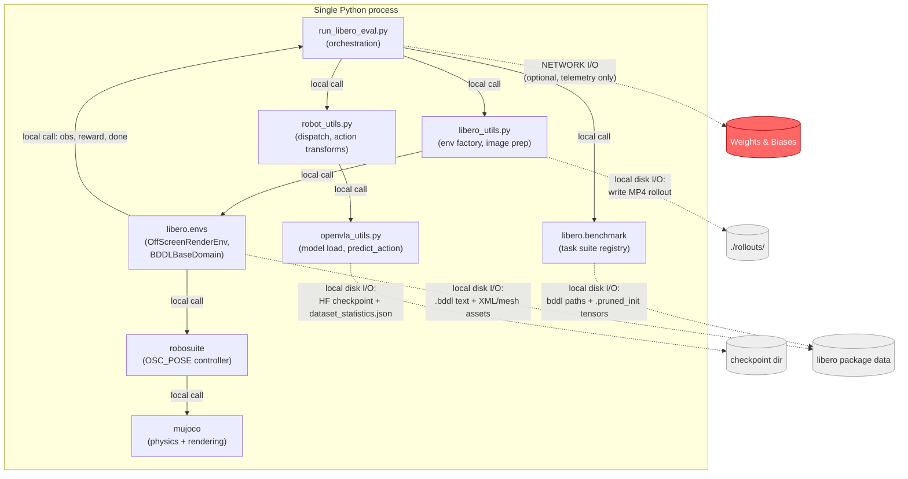

# LIBERO Simulation — Data/Control Flow Design

This document describes, at a low level, how data and control flow through the LIBERO
simulation evaluation pipeline as used in this repo (`experiments/robot/libero/run_libero_eval.py`).
It identifies the interfaces between components and classifies each step as either **local
computation**, **local disk I/O**, or **network I/O**.

## 1. Overview

LIBERO evaluation in this repo is a **single-process pipeline**. One Python process parses a
CLI config, loads the OpenVLA model and processor into local (GPU) memory, then runs a nested
task → episode → timestep loop that alternates between querying the model for an action and
stepping a MuJoCo physics simulation with that action.

There is no client/server or RPC boundary between the policy and the simulator — the model
object and the simulation environment object live in the same process and are called as plain
Python function calls. The **only** network call anywhere in the pipeline is optional
Weights & Biases (W&B) telemetry logging, which is orthogonal to the control loop (fire-and-forget
metrics, not on the inference critical path).

A separate subsystem in this repo, `vla-scripts/deploy.py` (a FastAPI/`uvicorn` HTTP server
exposing `POST /act`) plus `vla-scripts/ping_client.py` (its test client), implements an
alternative client-server architecture for OpenVLA inference using `json_numpy`-serialized
HTTP requests. It duplicates the same prompt-construction and `predict_action` logic found in
`experiments/robot/openvla_utils.py`, but **it is not imported by or connected to
`run_libero_eval.py` in any way** — it is an independent, currently unused code path and is
out of scope for the rest of this document.

## 2. Component Map

| Module | Responsibility | I/O character |
|---|---|---|
| `experiments/robot/libero/run_libero_eval.py` | Orchestrates the run: config, task/episode/timestep loops | Control flow (local) |
| `experiments/robot/libero/libero_utils.py` | LIBERO env factory, image preprocessing, dummy action, rollout video saving | Local compute + local disk I/O |
| `experiments/robot/robot_utils.py` | Model-family-agnostic dispatch (`get_model`, `get_action`), gripper action transforms | Local compute / dispatch |
| `experiments/robot/openvla_utils.py` | OpenVLA-specific model/processor loading, prompt construction, `predict_action` call | Local disk I/O (checkpoint load) + local GPU compute (forward pass) |
| `libero.libero.benchmark` (installed at `.libero-venv-3.10/src/libero`) | Task suite registry, bddl file path resolution, `.pruned_init` initial-state loading | Local disk I/O |
| `libero.libero.envs` (`OffScreenRenderEnv` / `BDDLBaseDomain`) | BDDL parsing, MuJoCo scene construction, `reset`/`step`/observation assembly, success checking | Local disk I/O (assets/bddl files) + local compute |
| `robosuite` (`OSC_POSE` controller, `SingleArm.control`) | Converts a delta end-effector pose action into joint torques | Local numpy compute |
| `mujoco` (via `robosuite.utils.binding_utils.MjSim`) | Physics integration and offscreen camera rendering | Local compute (C library / OpenGL-EGL rasterization) |
| `wandb` (optional, `cfg.use_wandb`) | Remote metrics/log-file upload | **Network I/O** — the only network hop in the pipeline |



## 3. Configuration & Startup

`GenerateConfig` (`run_libero_eval.py:55-88`) is a `@dataclass` parsed from CLI args by
`@draccus.wrap()` (`run_libero_eval.py:91`). It carries model params (`model_family`,
`pretrained_checkpoint`, `load_in_8bit`/`load_in_4bit`, `center_crop`), LIBERO params
(`task_suite_name`, `num_steps_wait`, `num_trials_per_task`), and logging/W&B params
(`run_id_note`, `local_log_dir`, `use_wandb`, `wandb_project`/`wandb_entity`, `seed`).

Startup sequence inside `eval_libero(cfg)`:

1. `set_seed_everywhere(cfg.seed)` (`robot_utils.py:29`) — seeds Python/NumPy/Torch RNGs. Local compute.
2. `cfg.unnorm_key = cfg.task_suite_name` — dynamically attached config field used to select action normalization stats.
3. `model = get_model(cfg)` (`robot_utils.py:40`) → `get_vla(cfg)` (`openvla_utils.py:31`) → `AutoModelForVision2Seq.from_pretrained(...)`. **Local disk I/O** (reads HF checkpoint from local path) + GPU memory allocation.
4. Validate/resolve `cfg.unnorm_key` against `model.norm_stats` (loaded from `dataset_statistics.json` alongside the checkpoint).
5. `processor = get_processor(cfg)` (`openvla_utils.py:75`) → `AutoProcessor.from_pretrained(...)`. Local disk I/O.
6. Open a local log file (`local_log_dir/run_id.txt`). Local disk I/O.
7. If `cfg.use_wandb`: `wandb.init(...)`. **Network I/O** — the only network call before the eval loop starts.
8. `benchmark_dict = benchmark.get_benchmark_dict(); task_suite = benchmark_dict[cfg.task_suite_name]()` (`run_libero_eval.py:141-142`) — instantiates the LIBERO `Benchmark` subclass, which populates its task list from package-bundled metadata. Local disk I/O + local compute.

## 4. Per-Task / Per-Episode / Per-Timestep Control Loop

The core of `eval_libero` is three nested loops (`run_libero_eval.py:155-298`):

**Per task** (`for task_id in range(num_tasks_in_suite)`):
- `task = task_suite.get_task(task_id)` — returns a `Task` namedtuple (name, language, bddl file, init-states file).
- `initial_states = task_suite.get_task_init_states(task_id)` — `torch.load(...)` of a `.pruned_init` file: a tensor of pre-recorded MuJoCo simulator states. Local disk I/O.
- `env, task_description = get_libero_env(task, cfg.model_family, resolution=256)` (`libero_utils.py:18`) — resolves the bddl file path via `get_libero_path("bddl_files")`, constructs `OffScreenRenderEnv(bddl_file_name=..., camera_heights=256, camera_widths=256)`. Internally this parses the bddl file and builds the full MuJoCo scene (arena + fixtures + objects) from XML/mesh assets on disk — local disk I/O + local compute, no network.

**Per episode** (`for episode_idx in range(cfg.num_trials_per_task)`):
- `env.reset()` — resamples object placements per BDDL `:init` predicates (robosuite placement samplers, local compute), retrying on `RandomizationError`.
- `obs = env.set_init_state(initial_states[episode_idx])` — overrides the resampled state with the pre-recorded deterministic initial state (sets the raw MuJoCo state vector, calls `sim.forward()`). Local compute.
- `max_steps` is chosen per task suite (hardcoded budgets, e.g. 220 for `libero_spatial`, 520 for `libero_10`).

**Per timestep** (`while t < max_steps + cfg.num_steps_wait`):
- Warm-up phase (`t < cfg.num_steps_wait`): step the env with a constant no-op action (`get_libero_dummy_action`, `[0,0,0,0,0,0,-1]`) to let dropped objects settle. No model call.
- `img = get_libero_image(obs, resize_size)` (`libero_utils.py:50`) — extracts `obs["agentview_image"]`, flips 180°, resizes via a JPEG-encode/decode + Lanczos3 round trip (`resize_image`, `libero_utils.py:33`) to match training-time preprocessing. Pure local compute (TensorFlow ops, no GPU inference).
- Build the `observation` dict: `{"full_image": img, "state": concat(eef_pos, quat2axisangle(eef_quat), gripper_qpos)}`. Note: OpenVLA does not actually consume the `state` field as model input — it's included for parity with other model families.
- `action = get_action(cfg, model, observation, task_description, processor=processor)` (`robot_utils.py:63`) → `get_vla_action(...)` (`openvla_utils.py:127`):
  - Optional center-crop (`crop_and_resize`, TF-based, matches training-time crop augmentation).
  - Builds a text prompt (`"In: What action should the robot take to {task}?\nOut:"` or the v0.1 chat-style variant).
  - `inputs = processor(prompt, image).to(DEVICE, dtype=torch.bfloat16)` — tokenizes/encodes, moves tensors to the local accelerator.
  - `action = vla.predict_action(**inputs, unnorm_key=unnorm_key, do_sample=False)` — **the one GPU forward pass per timestep**, entirely in-process.
- `action = normalize_gripper_action(action, binarize=True)` then, for `openvla`, `invert_gripper_action(action)` — pure numeric remaps of the gripper dimension (`robot_utils.py:75,95`).
- `obs, reward, done, info = env.step(action.tolist())` — see §5 for what happens inside this call.
- On `done`: increment success counters and break the timestep loop.

**Episode end:** `save_rollout_video(...)` (`libero_utils.py:61`) writes an MP4 via `imageio` to `./rollouts/<date>/`. Local disk I/O.

**Task end:** log success rate; if `cfg.use_wandb`, `wandb.log(...)` — network I/O (metrics only, not on the inference path).
Latency / step-count telemetry is also flushed here and at the end of the run; see
[`telemetry_extension.md`](./telemetry_extension.md).

```mermaid
sequenceDiagram
    participant Loop as run_libero_eval.py<br/>(control loop)
    participant Prep as libero_utils.py<br/>(image prep, local compute)
    participant VLA as OpenVLA model<br/>(in-process, GPU compute)
    participant Env as LIBERO env<br/>(OffScreenRenderEnv)
    participant Ctrl as robosuite<br/>OSC_POSE controller
    participant Sim as MuJoCo sim<br/>(C library, local compute)

    Loop->>Prep: get_libero_image(obs, resize_size)
    Prep-->>Loop: preprocessed image (local compute)
    Loop->>VLA: predict_action(image, instruction)
    Note over VLA: local GPU forward pass<br/>(no network hop)
    VLA-->>Loop: action (7-dim delta pose + gripper)
    Loop->>Loop: normalize/invert gripper action (pure numpy)
    Loop->>Env: env.step(action)
    Env->>Ctrl: control(action)
    Ctrl->>Ctrl: OSC Jacobian-based torque computation
    Ctrl->>Sim: sim.data.ctrl[...] = torques
    Sim->>Sim: sim.step() / sim.forward()<br/>(physics integration)
    Sim->>Sim: offscreen camera render<br/>(OpenGL/EGL rasterization)
    Env->>Env: _check_success()<br/>(BDDL goal-predicate eval over live sim state)
    Env-->>Loop: obs, reward, done, info
```

## 5. LIBERO Internals: BDDL → Scene → Success

- **Benchmark/Task abstraction** (`libero/benchmark/__init__.py`): `Benchmark` subclasses (`LIBERO_SPATIAL`, `LIBERO_OBJECT`, `LIBERO_GOAL`, `LIBERO_10`, `LIBERO_90`, `LIBERO_100`) populate a task list from bundled metadata, applying a fixed `task_orders` permutation. `get_task_bddl_file_path(i)` and `get_task_init_states(i)` resolve to local files under the package's `bddl_files/` and `init_files/` directories.
- **BDDL parsing** (`libero/envs/bddl_utils.py`, wrapping the external `bddl` package): parses a `.bddl` text file into `objects`, `fixtures`, `regions`, `initial_state` (`:init` predicates — drives placement sampling at `reset()`), and `goal_state` (`:goal` predicates — evaluated every step by `_check_success()`).
- **Scene construction** (`BDDLBaseDomain._load_model`, `libero/envs/bddl_base_domain.py`): builds a MuJoCo arena from XML assets, instantiates fixtures/objects per the parsed problem, merges everything into one `ManipulationTask` MJCF tree. All local disk I/O (asset files) + in-memory tree construction — no network.
- **Action space**: 7-dim `[dx, dy, dz, d-roll, d-pitch, d-yaw, gripper]`. Default controller is `OSC_POSE` (operational-space control on full 6-DoF pose), configured for **delta** control (`control_delta: true`), clipped to ±5 cm position / ±0.5 rad orientation per step (`robosuite/controllers/config/osc_pose.json`).
- **Action → torque**: `robosuite.robots.single_arm.SingleArm.control` splits the action into arm/gripper components, feeds the delta pose to `OperationalSpaceController.set_goal`, computes Jacobian-based impedance torques via `run_controller()`, clips to torque limits, and writes them into `sim.data.ctrl[...]`. Pure local numpy compute.
- **Observation dict**: `agentview_image`, `robot0_eye_in_hand_image` (RGB, from MuJoCo offscreen rendering), `robot0_eef_pos`/`robot0_eef_quat`, `robot0_gripper_qpos`, `robot0_joint_pos`, plus per-object pose sensors (used for BDDL predicate evaluation and available to state-based policies, though unused by OpenVLA).
- **Success checking**: `_check_success()` ANDs the evaluation of each `goal_state` predicate (`libero/envs/predicates/base_predicates.py` — `On`, `In`, `Open`, `Close`, `TurnOn`, `TurnOff`, `Stack`, contact-based predicates), each of which queries live MuJoCo body/geom positions and contact state. Pure local computation over current physics state, invoked from both `step()` (sets `done`) and `reward()` (sparse `+1.0`/`0.0`).

## 6. I/O vs. Compute Classification (Summary)

| Stage | Type | Location |
|---|---|---|
| CLI config parsing | Local compute | `draccus.wrap()` |
| Model/processor checkpoint load | Local disk I/O + GPU alloc | `openvla_utils.py: get_vla, get_processor` |
| bddl file text parsing (objects/regions/init/goal) | Local disk I/O | `bddl_utils.py`, external `bddl` package |
| Scene/XML/mesh asset loading | Local disk I/O | `bddl_base_domain.py:_load_model` |
| `.pruned_init` initial-state loading | Local disk I/O | `benchmark/__init__.py:get_task_init_states` |
| Object placement sampling at reset | Local compute (numpy) | `bddl_base_domain.py:_reset_internal` |
| Image preprocessing (resize/crop/flip) | Local compute (TensorFlow ops) | `libero_utils.py`, `openvla_utils.py:crop_and_resize` |
| VLA inference (forward pass) | Local compute (GPU) | `openvla_utils.py:get_vla_action → vla.predict_action` |
| Action → torque (OSC controller) | Local compute (numpy) | `robosuite/robots/single_arm.py`, `robosuite/controllers/osc.py` |
| Physics stepping | Local compute (MuJoCo C library) | `robosuite` base env `step()`, `mujoco` bindings |
| Camera image rendering | Local compute (offscreen OpenGL/EGL) | `robosuite/utils/binding_utils.py:MjSim.render` |
| Goal/success predicate evaluation | Local compute (live sim state query) | `envs/predicates/base_predicates.py` |
| Rollout video save | Local disk I/O | `libero_utils.py:save_rollout_video` |
| W&B metrics/log upload | **Network I/O** | `wandb.init`, `wandb.log`, `wandb.save` |

**Bottom line:** every step of a LIBERO episode — perception, inference, control, physics,
rendering, and success detection — is local computation or local disk I/O within a single
process. The pipeline crosses a network boundary exactly once per run (optionally), for
telemetry, and never on the perception→action→physics critical path.
