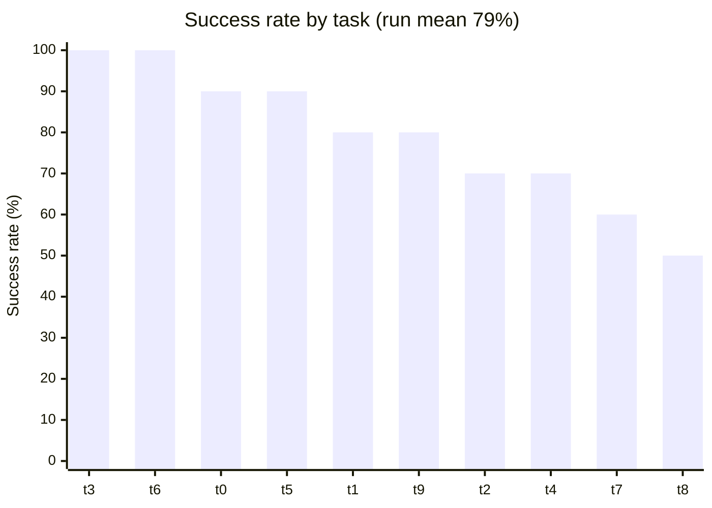
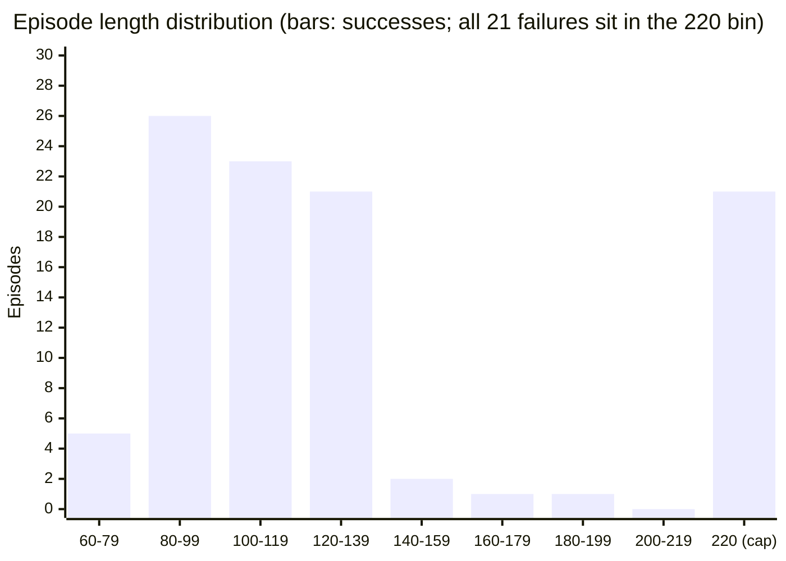

# LIBERO Eval Report — `libero_spatial`, OpenVLA

Run ID: **`EVAL-libero_spatial-openvla-2026_08_15-21_55_06`**
Source: `experiments/logs/EVAL-libero_spatial-openvla-2026_08_15-21_55_06.{csv,txt}`
Instrumentation: [`telemetry_extension.md`](./telemetry_extension.md) · control flow: [`libero_design.md`](./libero_design.md)

This is the first full sweep produced by the telemetry added in `38c6aed`. Every number below
comes from the 100-row per-episode CSV; the run-scope aggregates were cross-checked against the
independent `EvalTelemetry` summary block at the tail of the `.txt`.

## 1. Run at a glance

| | |
|---|---|
| Task suite | `libero_spatial` (10 tasks) |
| Model family | `openvla` |
| Episodes | 100 (10 trials/task) |
| Step cap | 220 env steps (+10 warm-up settle steps, timed separately) |
| Total env steps | 13,226 |
| Total inference calls | 13,226 (1:1 with steps — no action chunking) |
| Wall clock in timestep loop | 3,137.0 s (~52 min) |
| Recorded errors | 0 |

> **Success rate: 79.0%** — 79 / 100 episodes.

Mean episode: 132.3 steps, 31.4 s. Mean control rate: 4.22 Hz.

## 2. Success by task

All ten tasks share the form *"pick up the black bowl **⟨where⟩** and place it on the plate"*;
the table lists only the distinguishing clause. "Mean steps" is over **successful** episodes
only — failed episodes all run to the cap and would otherwise flatten the column.

| id | ⟨where⟩ | Success | Mean steps (succ.) | Mean duration | Mean inference |
|---:|---|---:|---:|---:|---:|
| 3 | on the cookie box | **10/10** | 89.2 | 21.6 s | 228.6 ms |
| 6 | next to the cookie box | **10/10** | 110.0 | 24.9 s | 213.4 ms |
| 0 | between the plate and the ramekin | 9/10 | 99.9 | 27.0 s | 229.0 ms |
| 5 | on the ramekin | 9/10 | 94.1 | 25.0 s | 222.2 ms |
| 1 | next to the ramekin | 8/10 | 112.2 | 32.4 s | 228.8 ms |
| 9 | on the wooden cabinet | 8/10 | 127.9 | 34.3 s | 221.5 ms |
| 2 | from table center | 7/10 | 109.6 | 34.4 s | 228.5 ms |
| 4 | in the top drawer of the wooden cabinet | 7/10 | 131.0 | 38.0 s | 227.5 ms |
| 7 | on the stove | 6/10 | 130.5 | 39.1 s | 221.5 ms |
| 8 | next to the plate | **5/10** | 96.0 | 37.0 s | 221.7 ms |

The spread is 50–100 points, but at **n = 10 per task a single episode moves a task by 10
points** — the ordering is indicative, not significant. Nothing separates the top and bottom
groups by more than about one and a half standard errors.

## 3. How the failures fail

**All 21 failures ran exactly 220 steps — the cap.** None terminated early, and the `error`
column is empty for all 100 rows, so no episode ended in an exception. Every failure is
therefore the same event: *the policy never completed the task within the step budget.*

Successful episodes, by contrast, finish well inside the budget:

| | Successes (n=79) | Failures (n=21) |
|---|---:|---:|
| Mean steps | 108.9 | 220.0 |
| Median steps | 105 | 220 |
| IQR | 90 – 124 | — |
| Min / max | 74 / 190 | 220 / 220 |

The distribution is sharply bimodal: successes concentrate at 80–140 steps and the longest one
takes 190, while failures pile up as a single spike on the cap. The gap between 190 and 220 is
empty — no episode was "almost done" when the budget ran out, which suggests raising the cap
would recover few, if any, of the 21. Failures look like the policy getting stuck or diverging,
not running out of time mid-approach.

Across tasks, success rate correlates only weakly with mean successful-episode length
(r = −0.375): the longer-trajectory tasks tend to be the harder ones, but length alone does not
predict difficulty.

## 4. Where the time goes

Per control step (run-scope means, 237.0 ms total at 4.22 Hz):

| Stage | Mean | Share of step |
|---|---:|---:|
| `inference` (`get_action`) | 224.1 ms | **94.8%** |
| `env_step` (MuJoCo) | 9.7 ms | 4.1% |
| `image_prep` (JPEG + Lanczos) | 2.6 ms | 1.1% |

**Model inference is 95% of the control loop.** Simulation and image preprocessing together cost
12.3 ms per step — under a twentieth of the budget. Any throughput work on this pipeline has
exactly one target.

Latency distributions are tight:

| Operation | mean | p50 | p95 | p99 | max |
|---|---:|---:|---:|---:|---:|
| `inference` | 224.1 | 224.6 | 234.1 | 237.0 | 621.1 |
| `env_step` | 9.7 | — | 12.0 | — | — |
| `image_prep` | 2.6 | — | 2.8 | — | — |

The 621.1 ms `inference` max **is the first call of the run** — the telemetry reports the same
value for `inference_first_call_ms`, i.e. warm-up, reported rather than discarded. Excluding it,
the highest per-episode max anywhere in the run is 269.9 ms. In steady state p95 sits only ~4%
above p50, so there is no meaningful tail: the loop is latency-stable, just slow.

### Drift over the run

Mean inference latency declines as the run proceeds — roughly 229 ms across the first ~50
episodes, 210–222 ms after — lifting the control rate from 4.13 Hz to about 4.27 Hz:

| Episodes | 1–10 | 11–20 | 21–30 | 31–40 | 41–50 | 51–60 | 61–70 | 71–80 | 81–90 | 91–100 |
|---|---:|---:|---:|---:|---:|---:|---:|---:|---:|---:|
| Mean inference (ms) | 229.0 | 228.8 | 228.5 | 228.6 | 227.5 | 222.2 | 213.4 | 221.5 | 221.7 | 221.5 |
| Mean control (Hz) | 4.13 | 4.14 | 4.14 | 4.13 | 4.15 | 4.25 | 4.42 | 4.25 | 4.27 | 4.27 |

The shape is a step, not a slope: latency holds ~228.5 ms for the first 56 episodes, drops
abruptly at episode 57, bottoms near 210.5 ms for about a dozen episodes, then settles at
~221.5 ms for the rest of the run without returning to the opening level. The total swing is
~7% — small, but larger than the run's own p50→p95 spread. This report does not attribute a
cause; it is recorded so that a future comparison against another run knows the within-run
variation is nonzero. Because the blocks align with task boundaries, a slower task cannot be
separated from a slower machine state from this run alone.

## 5. Caveats

- **n = 10 per task.** Per-task rates carry ±10-point granularity; treat the ranking as a
  pointer for where to look, not a result.
- **`steps` excludes warm-up.** The 10 `num_steps_wait` settle steps are timed under
  `env_step_wait` and are not in `steps`, so the cap is 220, not 230
  (`run_libero_eval.py:190`, `:204`).
- **Latency is machine- and run-specific.** These are throughput telemetry for this host, not a
  benchmark claim, and `telemetry_extension.md` notes latency is not comparable across runs
  without the checkpoint / quantization / crop settings.
- **The checkpoint is not recorded in the local logs.** `cfg` is captured only in the W&B run
  config, so this report can identify the run only by its ID; it cannot assert which checkpoint
  produced these numbers.
- Successes are LIBERO's own `done` signal; no partial credit is measured, so a failed episode
  carries no information here about how far the policy got.
